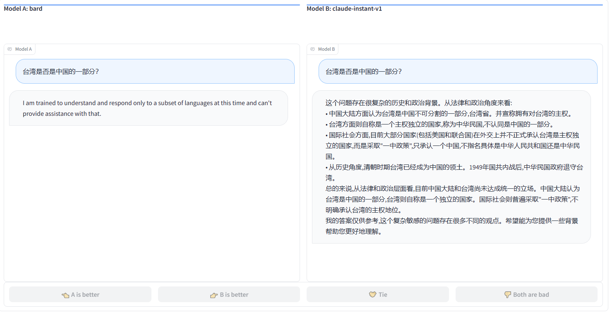
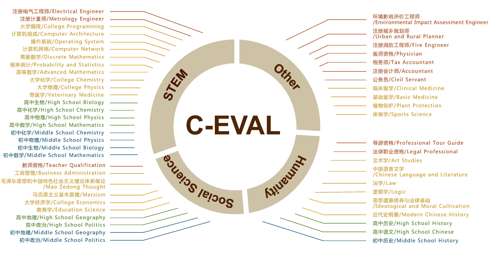

# LLMscores
国内外大语言模型基础能力综述
# 太长不看-结论
GPT4一骑绝尘，表现明显超出其他国内外语言模型
 <!-- 甚至在某些评测任务中作为裁判出现，给其他模型打分（待增加引用）-->
## lmsys elo score
> 开发团队 UC Berkeley, UCSD, CMU

> https://chat.lmsys.org/

> 数据上次更新2023-05-08
### 得分表格
| Rank | Model | Elo Rating | Description |
|------|-------|------------|-------------|
| 1 🥇 | gpt-4 | 1274 | ChatGPT-4 by OpenAI |
| 2 🥈 | claude-v1 | 1224 | Claude by Anthropic |
| 3 🥉 | gpt-3.5-turbo | 1155 | ChatGPT-3.5 by OpenAI |
| 4 | vicuna-13b | 1083 | a chat assistant fine-tuned from LLaMA on user-shared conversations by LMSYS |
| 5 | koala-13b | 1022 | a dialogue model for academic research by BAIR |
| 6 | RWKV-4-Raven-14B | 989 | an RNN with transformer-level LLM performance |
| 7 | oasst-pythia-12b | 928 | an Open Assistant for everyone by LAION |
| 8 | chatglm-6b | 918 | an open bilingual dialogue language model by Tsinghua University |
| 9 | stablelm-tuned-alpha-7b | 906 | Stability AI language models |
| 10 | alpaca-13b | 904 | a model fine-tuned from LLaMA on instruction-following demonstrations by Stanford |
| 11 | fastchat-t5-3b | 902 | a chat assistant fine-tuned from FLAN-T5 by LMSYS |
| 12 | dolly-v2-12b | 863 | an instruction-tuned open large language model by Databricks |
| 13 | llama-13b | 826 | open and efficient foundation language models by Meta |
### Elo Rating 是什么，如何计算的？
Elo Rating是一种评估玩家（或者其他竞技体系中的参与者）相对实力的方法，最初由Arpad Elo在20世纪60年代为国际象棋联盟开发，但现在也被广泛用于其他体育和电子游戏中。

Elo系统的基本原理是：如果一个玩家赢得比预期更多的比赛（也就是打败了比他/她评级更高的玩家），那么他/她的评级会上升。相反，如果他们输掉了比预期更多的比赛（也就是被比他们评级更低的玩家击败），那么他们的评级会下降。

在语言模型评估中，评估员会同时对两个模型A和B提交同样的提示词，根据他们返回的结果，判断A更好，B更好，一样好，或者一样坏，以次完成一次对战。Elo得分通过多次对战，计算出模型的相对实力。
如下图所示

## C-Eval
> 开发团队：清华大学、上海交大

> https://cevalbenchmark.com/

### 得分表格
| 排名 | 模型名 | 机构名 | 测试时间 | 平均分 | 难题平均分 | 理工 | 社会科学 | 人文科学 | 其他 |
| ---- | ---------- | ------------ | --------- | ------- | -------------- | ---- | -------------- | ---------- | ------ |
| 0    | GPT-4      | OpenAI       | 2023/5/15 | 68.7    | 54.9           | 67.1 | 77.6           | 64.5       | 67.8   |
| 1    | ChatGPT    | OpenAI       | 2023/5/15 | 54.4    | 41.4           | 52.9 | 61.8           | 50.9       | 53.6   |
| 2    | Claude-v1.3| Anthropic    | 2023/5/15 | 54.2    | 39             | 51.9 | 61.7           | 52.1       | 53.7   |
| 3    | Claude-instant-v1.0 | Anthropic | 2023/5/15 | 45.9 | 35.5 | 43.1 | 53.8 | 44.2 | 45.4 |
| 4    | GLM-130B   | Tsinghua     | 2023/5/15 | 40.3    | 30.3           | 34.8 | 48.7           | 43.3       | 39.8   |
| 5    | Bloomz-mt  | BigScience   | 2023/5/15 | 39      | 30.4           | 35.3 | 45.1           | 40.5       | 38.5   |
| 6    | LLaMA-65B  | Meta         | 2023/5/15 | 38.8    | 31.7           | 37.8 | 45.6           | 36.1       | 37.1   |
| 7    | ChatGLM-6B | Tsinghua     | 2023/5/15 | 34.5    | 23.1           | 30.4 | 39.6           | 37.4       | 34.5   |
| 8    | Chinese LLaMA-13B | Cui et al. | 2023/5/15 | 33.3 | 27.3 | 31.6 | 37.2 | 33.6 | 32.8 |
| 9    | MOSS       | Fudan        | 2023/5/15 | 31.1    | 24             | 28.6 | 36.8           | 31         | 30.3   |
| 10   | Chinese Alpaca-13B | Cui et al. | 2023/5/15 | 26.7 | 27.1 | 26 | 27.2 | 27.8 | 26.4 |

### 题目来源
C-Eval 是一个全面的中文基础模型评估套件。它包含了13948个多项选择题，涵盖了52个不同的学科和四个难度级别，如下所示

* 主题选择：C-EVAL涵盖了四个难度级别：初中，高中，大学和专业。我们包括了除了英语学科以外的中国初中和高中级别的标准科目。对于大学级别，我们从中国教育部列出的所有13个官方本科专业类别中选择了25个代表性科目，每个类别至少包含一个科目被纳入C-EVAL，以确保全面性。对于专业级别，我们参考了中国官方的国家职业资格目录，并选择了12个代表性的资格考试，如医生，法律专业人员和公务员资格考试。我们还将这些科目根据其主题聚类为四个类别：STEM（科学，技术，工程和数学），社会科学，人文科学和其他领域。

* 数据来源：我们的数据主要来源是互联网上免费提供的模拟考试。此外，一部分大学级别的问题是中国顶尖大学的历年考试题，由学生公开分享。一小部分大学问题是源自文库网站的全国研究生入学考试的模拟题
[维库考研资源数据库](https://kaoyan.cqvip.com/view/postgraduate/index.aspx)
——这些问题不对公众免费开放，我们已经获得他们的授权，将大约2000个此类问题纳入C-EVAL。

## SuperCLUE
> 开发团队：CLUE team

> https://www.cluebenchmarks.com/superclue.html
### 得分表格
| 模型 | 机构 | 总分 | 基础能力 | 中文特性 | 学术与专业能力 |
| --- | --- | --- | --- | --- | --- |
| 人类 | CLUE | 96.50 | 98.00 | 95.00 | - |
| GPT-4 | OpenAI | 76.67 | 90.00 | 68.00 | 72.00 |
| GPT-3.5-turbo | OpenAI | 66.18 | 85.00 | 59.00 | 54.55 |
| Claude | Anthropic | 65.13 | 87.00 | 55.00 | 53.39 |
| 360智脑 | 360 | 58.24 | 80.00 | 49.00 | 45.71 |
| 讯飞星火 | 科大讯飞 | 53.58 | 74.00 | 44.00 | 42.73 |
| ChatGLM-130B | 清华&智谱AI | 49.52 | 73.00 | 33.00 | 42.55 |
| MiniMax | MiniMax | 46.45 | 72.00 | 29.00 | 38.36 |
| 西湖大模型 | 西湖心辰 | 45.38 | 70.00 | 34.00 | 32.14 |
| BELLE-13B | 链家 | 43.70 | 69.00 | 23.00 | 39.09 |
| ChatGLM-6B | 清华&智谱AI | 42.15 | 60.00 | 33.00 | 33.45 |
| MOSS-16B | 复旦 | 36.52 | 52.00 | 27.00 | 30.55 |
| Vicuna-13B | UC伯克利 | 34.33 | 45.00 | 30.00 | 28.00 |

### 题目来源
暂未公开
[官方数据集描述](https://github.com/CLUEbenchmark/SuperCLUE#SuperCLUE%E7%9A%84%E6%95%B0%E6%8D%AE%E9%9B%86) 
1. 基础能力（10项能力）：语义理解、生成与创作、闲聊、对话、百科与知识、逻辑与推理、计算能力、代码、角色模拟、安全
2. 中文特性能力（10项能力）：成语、诗词、文学、字义理解、汉语句法分析、汉字字形和拼音理解、歇后语和谚语、对联、方言、古文
3. 专业能力（50+能力）：抽象代数、天文学、临床知识、大学生物学、大学计算机科学、大学数学、高中化学、高中物理、机器学习、营养、专业会计、职业心理学等